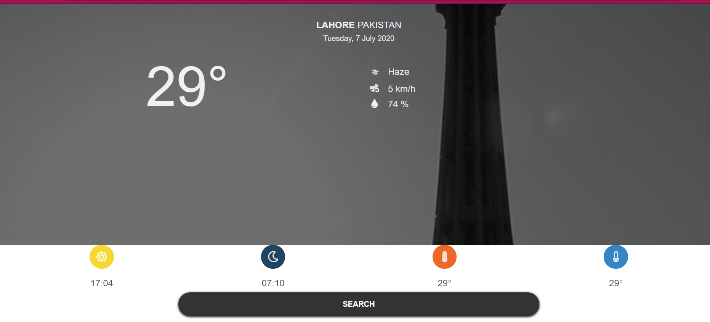

# Weather App

This is the 5th project of the Main Javascript curriculum at [Microverse](https://www.microverse.org/) - @microverseinc

* The objective is to build a page with interactivity using everything learn about **Objects**, **Factory Functions**, The **Module Pattern**
* The project was completed using Javascript language.

#### [Assignment link](https://www.theodinproject.com/courses/javascript/lessons/weather-app)



## Live Link
[Click Here]()

## Getting Started

These instructions will get you a copy of the project up and running on your local machine for development and testing purposes.

### Prerequisites

What things you need to install the software and how to install them
```
node
```


### Installing
```
npm install 

```


### Up and running
```
Open the index.html file in your browser
```
## Built With

- HTML5
- CSS
- JavaScript


## Authors
**Arslan Bisharat**


- Github: [@githubhandle](https://github.com/arslanbisharat)
- Twitter: [@twitterhandle](https://twitter.com/arslan_bisharat-2020bb156)
- Linkedin: [linkedin](https://www.linkedin.com/in/muhammad-arslan)

## 🤝 Contributing

Contributions, issues and feature requests are welcome!

Feel free to check the [issues page](https://github.com/arslanbisharat/weather-app-js/issues).

## Show your support

Give a ⭐️ if you like this project!
