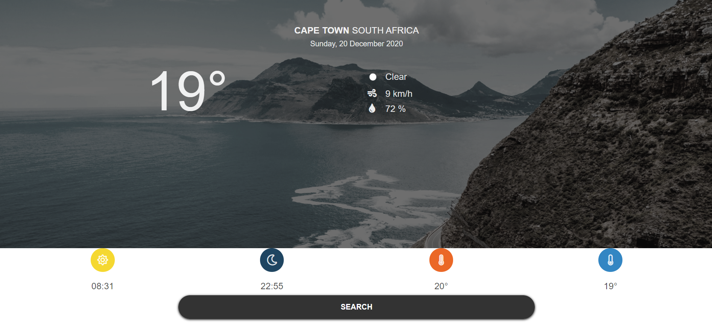

# Weather App

This is the 5th project of the Main Javascript curriculum at [Microverse](https://www.microverse.org/) - @microverseinc

* The objective is to build a page with interactivity using everything learn about **Objects**, **Factory Functions**, The **Module Pattern**
* The project was completed using Javascript language.

#### [Assignment link](https://www.theodinproject.com/courses/javascript/lessons/weather-app)




## What?
* This is a weather app built in Javascript, HTML, and CSS (no frameworks).
* Weather stats are fetched from [openweathermap](openweathermap.org).
* Photos are fetched from [flickr](flickr.com) depending on the city whose weather you're interested in.

## Why?
* This project was a way for me to practice the async/await feature of Javascript 
and a chance to build another small project from start to finish without the use of tutorials.
* It forms part of [The Odin Project's](theodinproject.com) curriculum. 

### Notes
1. The timestamps displayed for sunrise and sunset still need to be formatted correctly as they currently display times in the user's timezone.
1. This is best viewed on mobile devices as a fully responsive layout has not been implemented yet.

## Live Link
[Click Here](https://rawcdn.githack.com/arslanbisharat/weather-app-js/905c2ff657433925ba4ad712fb269bbb4e50a15e/dist/index.html)

## Getting Started

These instructions will get you a copy of the project up and running on your local machine for development and testing purposes.

### Prerequisites

What things you need to install the software and how to install them
```
node
```


### Installing
```
npm install 

```


### Up and running
```
Open the index.html file in your browser
```
## Built With

- HTML5
- CSS
- JavaScript


## Authors
**Arslan Bisharat**


- Github: [@githubhandle](https://github.com/arslanbisharat)
- Twitter: [@twitterhandle](https://twitter.com/arslan_bisharat-2020bb156)
- Linkedin: [linkedin](https://www.linkedin.com/in/muhammad-arslan)

## 🤝 Contributing

Contributions, issues and feature requests are welcome!

Feel free to check the [issues page](https://github.com/arslanbisharat/weather-app-js/issues).

## Show your support

Give a ⭐️ if you like this project!
